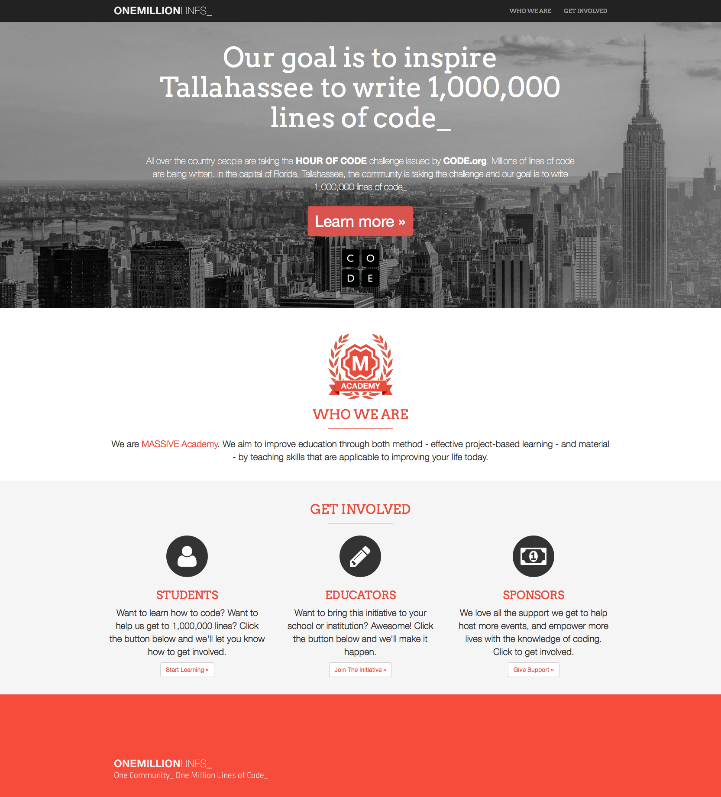

# Intégration - Entrainement #2

## Contexte
Le *preview* d'une maquette *desktop* vous est fourni au format PNG : concevez la version *mobile* de cette maquette avec Adobe Photoshop et réalisez l'integration *responsive* correspondant fidèlement au *preview desktop* et dàe votre maquette *mobile*.

> :warning: **Pensez mobile first !**
> Un dossier intitulé « menu » est fourni, il contient les sources HTML, CSS et JS d'un menu hamburger. Son utilisation n'est pas obligatoire.

### code.bmp
Vous remarquerez dans les sources un fichier intitulé « code.bmp » : reproduisez cette illustration avec Adobe Illustrator, enregistrez la source au format AI et au format SVG, et exportez le résultat au format PNG.

## Spécifications

### Police de caractères
```
Arvo en 400 et 700
```

### Couleurs
```
Couleur principal du design : #ff6347
```

### Icônes

Vous pouvez trouver des icônes sur les sites suivants :

https://heroicons.com  
https://feathericons.com  
https://icons.getbootstrap.com

## Modalités
- **Durée :** 3h
- **Livrables :** le lien vers un *repository* sur votre compte GitHub contenant :
    - la maquette de la version *mobile* au format PSD ;
    - le picto reproduisant le fichier « code.bmp » aux formats AI et SVG ;
    - l'intégration *responsive* en HTML / CSS / JS 

## Preview



